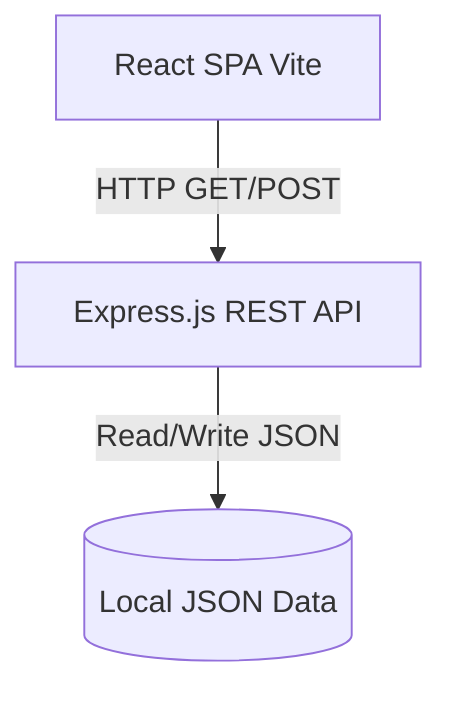

# GDG EventHub

[![Contributors][contributors-shield]][contributors-url]
[![Forks][forks-shield]][forks-url]
[![Stargazers][stars-shield]][stars-url]
[![Issues][issues-shield]][issues-url]
[![MIT License][license-shield]][license-url]

## About
**GDG EventHub** is a modern, responsive campus-event platform designed around discovering and registering for technical community events. It provides a simple, accessible way for students to explore tech communities and sign up for workshops, seminars, and networking sessions.

## Key Features
* **Event Discovery:** Browse a curated list of upcoming tech events.
* **Search & Filtering:** Quickly find events by title, speaker, or category (e.g., Open Source, AI/ML, Web Dev).
* **Detailed Event Views:** See comprehensive details including venue, time, capacity, and descriptions.
* **Seamless Registration:** Easy-to-use registration flow with immediate feedback.
* **REST API Backend:** A fully functional Node.js/Express API serving mock data.
* **Health Monitoring:** Dedicated health endpoint for system checks.
* **Automated Testing:** Pre-configured test suites for both frontend and backend.

## Tech Stack
**Frontend:**
* [React 18](https://react.dev/) - UI Library
* [Vite](https://vitejs.dev/) - Build Tool & Dev Server
* [React Router](https://reactrouter.com/) - Client-side routing
* [Vitest](https://vitest.dev/) & [React Testing Library](https://testing-library.com/docs/react-testing-library/intro/) - Testing

**Backend:**
* [Node.js](https://nodejs.org/) - Runtime
* [Express.js](https://expressjs.com/) - Web Framework
* [Jest](https://jestjs.io/) & [Supertest](https://github.com/ladjs/supertest) - API Testing

## Architecture Overview


## Project Structure
```text
GDG-OSS-48H-CHALLENGE/
├── frontend/             # React application (Vite)
│   ├── src/
│   │   ├── components/   # Reusable UI components (EventCard, Navbar, etc.)
│   │   ├── pages/        # Route-level components (Home, EventPage)
│   │   ├── services/     # API integration (Axios calls)
│   │   ├── styles/       # Global CSS
│   │   └── __tests__/    # Frontend test files
├── backend/              # Express API server
│   ├── src/
│   │   ├── data/         # JSON data store
│   │   ├── routes/       # API route definitions
│   │   └── server.js     # Express app initialization
│   └── tests/            # Backend integration tests
└── .github/              # GitHub templates (Issues, PRs, CODEOWNERS)
```

## Prerequisites
Before you begin, ensure you have the following installed on your machine:
- **Node.js** (v18.x or v20.x recommended)
- **npm** (comes with Node.js) or **yarn**
- **Git**

---

## Local Setup Instructions

### 1. Clone the repository
```bash
git clone https://github.com/Aryasurya12/GDG-OSS-48H-CHALLENGE.git
cd GDG-OSS-48H-CHALLENGE
```

### 2. Configure Environment Variables
The repository includes a `.env.example` file. Create a copy named `.env` in the root folder to configure local variables like the PORT.
```bash
cp .env.example .env
```

### 3. Install and Run Backend
Open a terminal and start the Express server:
```bash
cd backend
npm install
npm start
```
> **Note:** The backend API will run on `http://localhost:5000`. Leave this terminal open.

### 4. Install and Run Frontend
Open a **new** terminal, navigate to the frontend directory, and start the Vite dev server:
```bash
cd frontend
npm install
npm run dev
```
> **Note:** The frontend application will run on `http://localhost:5173`. Open this URL in your browser.

---

## Testing

Ensure code quality by running the automated tests. Both suites must pass before submitting a Pull Request.

**Run frontend tests:**
```bash
cd frontend
npm test
```

**Run backend tests:**
```bash
cd backend
npm test
```

---

## API Documentation

The backend provides the following RESTful endpoints:

### `GET /health`
Check API health status. Useful for load balancers or Docker health checks.
* **Response `200 OK`:** 
  ```json
  { "status": "ok" }
  ```

### `GET /api/events`
Retrieve an array of all upcoming events.
* **Response `200 OK`:** 
  ```json
  [
    {
      "id": "event-001",
      "title": "Introduction to Open Source",
      "date": "2026-09-15",
      "category": "Open Source"
    }
  ]
  ```

### `GET /api/events/:id`
Retrieve a specific event by its ID.
* **Response `200 OK`:** Single event object.
* **Response `404 Not Found`:** `{ "error": "Event not found" }`

### `POST /api/register`
Register a user for a specific event.
* **Request Body:** 
  ```json
  { 
    "name": "John Doe", 
    "email": "john@example.com", 
    "college": "GDG Campus", 
    "eventId": "event-001" 
  }
  ```
* **Response `201 Created`:** 
  ```json
  { 
    "message": "Registration successful", 
    "registration": { "id": "reg-12345", "name": "John Doe" } 
  }
  ```
* **Response `400 Bad Request`:** `{ "error": "Missing required fields" }`

---

## Troubleshooting

- **Port in use error (`EADDRINUSE`):** If port 5000 or 5173 is already in use by another application, you can change the `PORT` in the `.env` file or kill the existing process.
- **CORS Issues:** Ensure the frontend is calling `http://localhost:5000` (defined in `VITE_API_URL`). Check your `.env` configuration.
- **Node version errors:** Ensure you are running Node v18 or higher. Check your version with `node -v`.

---

## Interested in Contributing?
We welcome contributions! 
* For the general workflow, pull request guidelines, and coding standards, please see [CONTRIBUTING.md](CONTRIBUTING.md).
* If you are participating in the GDG Open Source challenge, refer strictly to [CHALLENGE.md](CHALLENGE.md).

## Security
For information on reporting vulnerabilities and our security practices, please read our [SECURITY.md](SECURITY.md) policy.

---
*Created with ❤️ by the GDG OSS Team*

[contributors-shield]: https://img.shields.io/github/contributors/Aryasurya12/GDG-OSS-48H-CHALLENGE.svg?style=for-the-badge
[contributors-url]: https://github.com/Aryasurya12/GDG-OSS-48H-CHALLENGE/graphs/contributors
[forks-shield]: https://img.shields.io/github/forks/Aryasurya12/GDG-OSS-48H-CHALLENGE.svg?style=for-the-badge
[forks-url]: https://github.com/Aryasurya12/GDG-OSS-48H-CHALLENGE/network/members
[stars-shield]: https://img.shields.io/github/stars/Aryasurya12/GDG-OSS-48H-CHALLENGE.svg?style=for-the-badge
[stars-url]: https://github.com/Aryasurya12/GDG-OSS-48H-CHALLENGE/stargazers
[issues-shield]: https://img.shields.io/github/issues/Aryasurya12/GDG-OSS-48H-CHALLENGE.svg?style=for-the-badge
[issues-url]: https://github.com/Aryasurya12/GDG-OSS-48H-CHALLENGE/issues
[license-shield]: https://img.shields.io/github/license/Aryasurya12/GDG-OSS-48H-CHALLENGE.svg?style=for-the-badge
[license-url]: https://github.com/Aryasurya12/GDG-OSS-48H-CHALLENGE/blob/main/LICENSE
